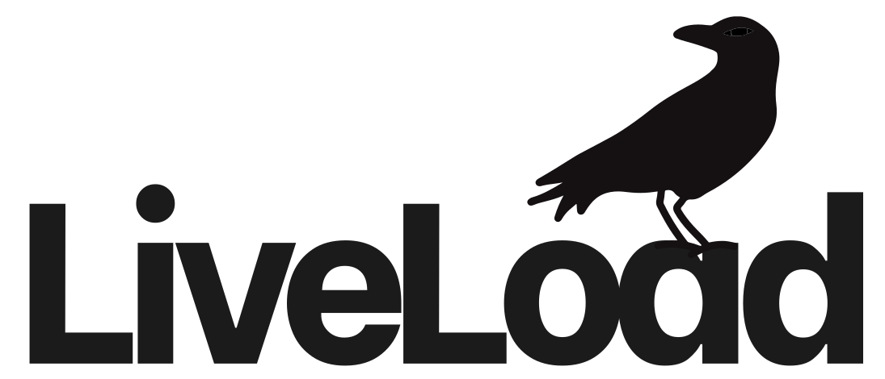

# LiveLoad


[](https://opensource.org/licenses/MIT)
[](https://hex.pm/packages/live_load)



A load testing framework for simulating real, distributed, live load on your application.

## Why LiveLoad?

Load testing a Phoenix LiveView app is harder than it looks. The existing approaches all fall short in different ways:

- **Script-based HTTP/WebSocket tools** can technically connect to LiveView... but you end up handrolling a LiveView client. Parse the CSRF token, `phx-session`, and `phx-static` from the HTML, manually build the `phx-join` message, reconstruct the wire format for every event you want to trigger. And hope nothing breaks between LiveView client updates.
- **Protocol-level tools** measure the transport, not the application. They can tell you that sending a WebSocket message took a few milliseconds, but they can't tell you how long a `phx-click` event took to get acknowledged by your LiveView and the DOM to finish patching.
- **Browser automation libraries** get it right: real browsers, real actions, real users. But real browsers cost real memory, and if you want enough of them to matter, one machine can't hold them. You need distributed machines. Which means coordination. Which means, if you're not careful, you reinvent OTP.

### What we actually need

1. **LiveView-aware metrics**: not just "how long did the socket respond", but "how long did the click event take to process and patch the DOM".
2. **Real browsers**: no handrolling protocol clients. Real Browser, running real JavaScript, connected to real WebSockets.
3. **More than one machine**: because real browsers cost real resources.

LiveLoad is built on three foundations that compose naturally because they're all just BEAM primitives:

- [**AMoC**](https://github.com/esl/amoc). A distributed load testing framework by Erlang Solutions. A user is just a process. Want 10,000 users? AMoC spins up 10,000 processes across the nodes it's connected to.
- [**FLAME**](https://github.com/phoenixframework/flame). Elastic, ephemeral nodes. Spin up machines for a test, and they disappear when it's done. FLAME nodes are just BEAM nodes, so they join your cluster and you send work to them.
- [**Playwright**](https://github.com/ftes/playwright_ex). Real browsers via PlaywrightEx. Each user gets an isolated browser context (basically a unique incognito tab), so we only need one browser per node.

No custom RPC layer, no node-discovery protocol, no work-distribution scheduler. The BEAM does everything for us.

## Installation

[LiveLoad is available on Hex](https://hex.pm/packages/live_load).

To install, add it to you dependencies in your project's `mix.exs`.

```elixir
def deps do
  [
    {:live_load, ">= 0.0.1"}
  ]
end
```

Then install the Playwright driver and browser binaries:

```bash
mix live_load.install
```

This downloads the Playwright standalone driver (no `npm install` required) and installs the browser into the `priv` directory for the `live_load` application. The binaries are platform-specific, so for production or CI environments, you'll need to run this on the target architecture.

### Docker / Release Builds

If you're running LiveLoad in a Docker container (which you probably are for distributed runs), you'll need to add Chromium's system dependencies to your Dockerfile. Add the following to your final Docker image layer:

```dockerfile
RUN apt-get update \
  && apt-get install -y --no-install-recommends \
      libglib2.0-0 \
      libnss3 \
      libnspr4 \
      libatk1.0-0 \
      libatk-bridge2.0-0 \
      libcups2 \
      libdbus-1-3 \
      libdrm2 \
      libxkbcommon0 \
      libxcomposite1 \
      libxdamage1 \
      libxext6 \
      libxfixes3 \
      libxrandr2 \
      libgbm1 \
      libpango-1.0-0 \
      libcairo2 \
      libasound2t64 \
      libatspi2.0-0 \
      libx11-6 \
      libxcb1 \
      libexpat1 \
  && rm -rf /var/lib/apt/lists/*
```

## Quick Example

Define a scenario:

```elixir
defmodule MyApp.LoadTest.BrowseScenario do
  use LiveLoad.Scenario

  @impl true
  def run(context, _user_id, _config) do
    context
    |> navigate("https://myapp.com/")
    |> wait_for_liveview()
    |> click("#load-more")
    |> wait_for_phx_loading_completion(:click, "#load-more")
  end
end
```

Run it:

```elixir
results = LiveLoad.run(
  scenario: MyApp.LoadTest.BrowseScenario,
  users: 50,
  scenario_duration: to_timeout(minute: 5)
)
```

Generate a report:

```elixir
html = LiveLoad.Reporter.HTML.render!(results)
File.write!("liveload_report.html", html)
```

## Distributed Runs

For larger tests, LiveLoad can distribute users across a FLAME-provisioned cluster of nodes:

```elixir
results = LiveLoad.run(
  otp_app: :my_app,
  users: 10_000,
  distributed?: true,
  flame_backend: FLAME.FlyBackend,
  cluster_opts: [
    flame_backend_opts: [app: :my_runner_app, cpus: 8, memory_mb: 16 * 1024],
    max_allowed_nodes: 100
  ]
)
```

LiveLoad handles the cluster formation, browser provisioning, and user distribution across nodes automatically. Each node gets its own browser instance, and users are distributed evenly across the cluster. When the test finishes, metrics from all nodes are merged into a single `LiveLoad.Result`.

## Project Status

LiveLoad is in active early development. The architecture works and is tested against real applications, but there are rough edges that are being actively worked on.

**Current limitations:**

- **WebSocket metrics only:** LiveLoad collects Phoenix.Socket-level metrics (frame sizes, frame rates) cleanly over WebSocket connections. If your app falls back to longpolling, those frame-level metrics won't be captured directly, since longpolling is just HTTP requests from the telemetry collection. All HTTP request metrics are collected however they are not filtered down into the longpolling fallback URL. **Browser-level LiveView metrics (mount times, `phx-*-loading` durations) are recorded regardless of transport.**
- **Cluster startup time at scale:** AMoC's cluster gossip protocol hits bottlenecks on larger clusters. LiveLoad works around this, but forming clusters above ~50 nodes still involves noticeable idle time during setup. This doesn't affect your results, since the load test duration timer starts after the cluster is ready, but it does mean you'll be waiting a bit before things kick off and it can affect your costs when running large load tests. **This is being actively worked on in order to lower costs and optimize the cluster startup times.**
- **Infrastructure ceiling:** The maximum number of concurrent users depends on your infrastructure provider's limits. Each browser context consumes real memory. LiveLoad calculates how many users fit per node based on available resources, but at roughly 2 users per CPU core under active LiveView scenarios, you'll need a meaningful number of nodes for large tests. **I am actively tracking other headless browser implementations such as LightPanda and Obscura to see whether switching to alternative implementations can help optimize the number of users that can be simulated per machine. Additionally, the `LiveLoad.Browser.Connection` module is a behaviour, allowing you to implement your own browser modules.**

## Documentation

Full documentation is available on [HexDocs](https://hexdocs.pm/live_load).

The [Writing Your First Scenario](https://hexdocs.pm/live_load/writing_your_first_scenario.html) guide is the best place to start. It covers everything from basic navigation to throttles, assigns, and the full scenario lifecycle.
